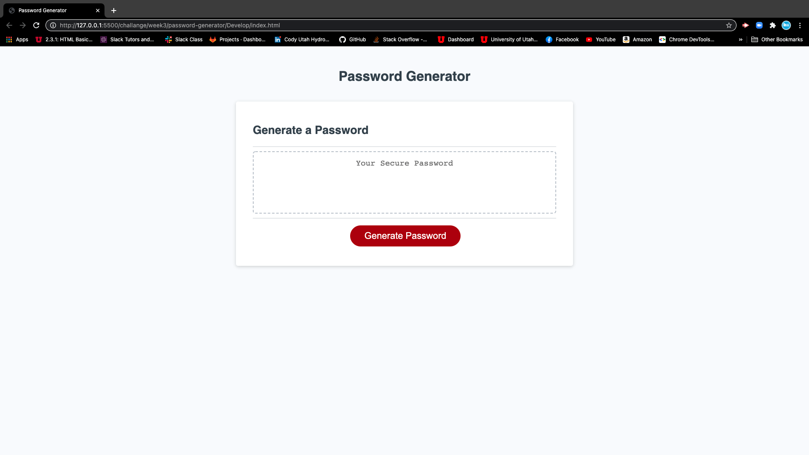
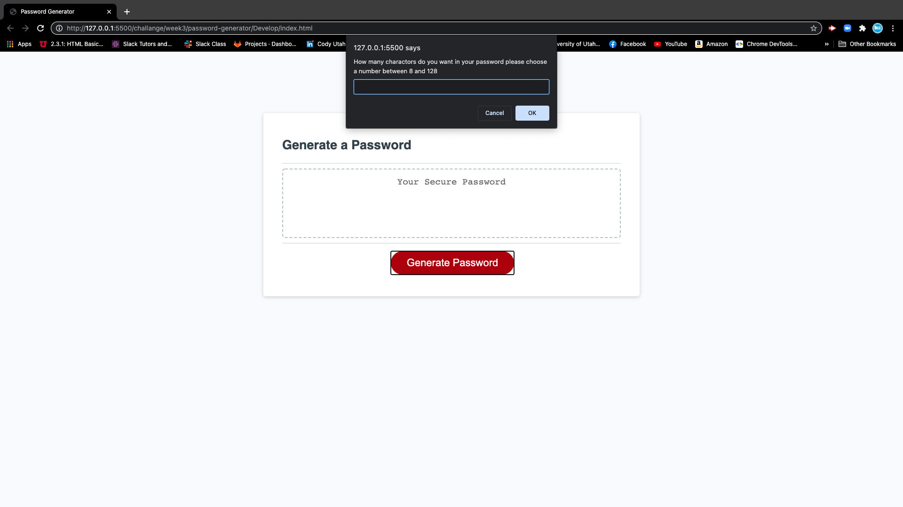
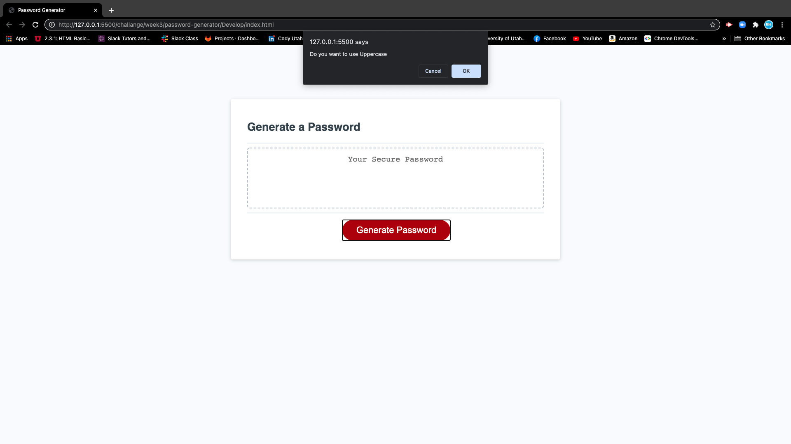
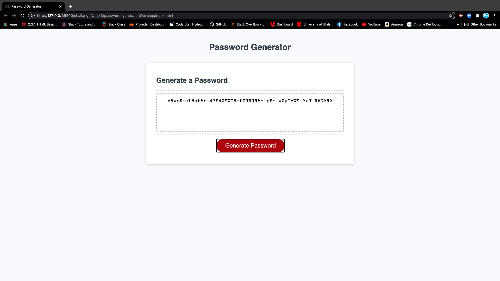

# Generate-Password

**This page will make you a randomized password**

*Link* [Generate-Password](https://cody1967.github.io/password-generator/)

---

#Main-Page 

.1 If you click on the Generate password button a prompt displays. 

  *How many charactors do you want in your password please choose a number between 8 and 128.*

.2 - If you enter a number between 8 and 128.

*Then it will ask you if you want to use uppercase charactors.*

*You can then either select ok or cancel meaning YES or NO.*

.3 - It will then ask you if you want to use lowercase charactors.

*You can then either select ok or cancel meaning YES or NO*

.4 - Then it will ask you if you want to use numbers.

*You can then either select ok or cancel meaning YES or NO.*

.5 - Then it will ask you if you want to use specialsymbols.
*You can then either select ok or cancel meaning YES or NO.*

.6 - After you get through the prompts then it publish a randomized password with the options you have selected(uppercase,lowercase,numbers,specialsymbols).

---

### Written by Cody McNeill